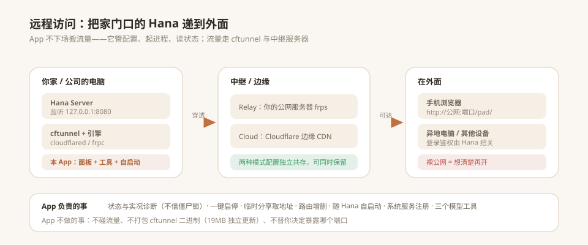
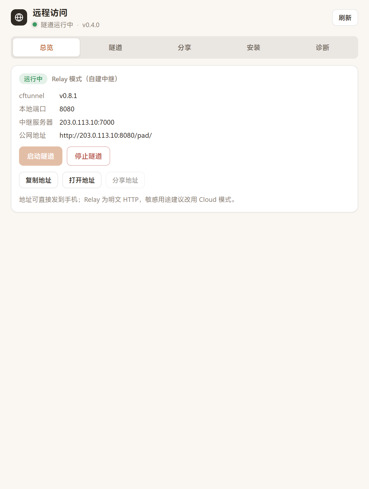

# 远程访问（Hana 远程访问 App）

> 把开源内网穿透工具 [cftunnel](https://qingchencloud.github.io/cftunnel/) 装进 Hana 的一块管理面板：**在外面，打开浏览器就能连回自己的 Hana。**



## 这是什么

Hana 跑在你自己的电脑上，服务只监听本机端口——出了家门就够不着。这个 App 把 **cftunnel**（Cloudflare Tunnel + frp 双引擎）的命令行操作全部搬进图形面板：

- 想看隧道通没通：打开面板一眼看到状态、服务器、公网地址；
- 想开/停隧道：一个按钮，不用记命令；
- 想临时分享：填个端口，几秒钟拿到 `*.trycloudflare.com` 临时地址；
- 想出门也能用：开启「随 Hana 启动自动拉起」，开机即通。

它是通用工具，不绑定任何人的服务器、端口或域名——装好后在设置页填你自己的中继地址即可；中继没配时，面板会引导你完成第一步。

## 我能用它做什么

| 想做的事 | 在面板里 |
|---|---|
| 在外面用浏览器连回家里的 Hana | 「总览」启动隧道 → 复制公网地址 → 手机浏览器打开（入口自动带 `/pad/`） |
| 装好 cftunnel 与两个引擎 | 「安装」标签：检查更新 / 一键升级 / 引擎预装修复 |
| 用 Cloud 模式（Cloudflare）穿透 | 「隧道」标签：填 API 令牌 + 账户 ID → 配置认证 → 创建隧道 → 按域名加路由 |
| 用 Relay 模式（自建 frp）穿透 | 「隧道」标签：填中继服务器 → 加规则（TCP/UDP） |
| 临时把某个端口分享给别人看 | 「分享」标签：填端口，可加终端二维码 / Telegram 分享 |
| 排查"显示在跑但访问不了" | 「诊断」标签：Relay 链路诊断、Cloud 诊断、日志 |
| 让隧道比 Hana 活得久 | 「隧道」标签：注册系统服务 + 随 Hana 自启动开关 |
| 直接在对话里操作 | 六个工具：`remote_access_status / control / diagnose / install / check_update / extra` |

## 与官方能力的一致性

本 App 是官方 CLI 的**图形外壳**，不是替代品：

- **命令、术语、模式语义全部以 [官方文档](https://qingchencloud.github.io/cftunnel/) 为准**，不自创用法。
- **本 App 的增益只有两处**：① 把命令搬到面板按钮；② 下载走国内镜像加速（官方本身不带此能力，其自动下载在国内容易失败）。
- 面板会**探测本机 cftunnel 版本**：官方新增的命令（如 `preset` / `history` / `share`）在你未升级前会置灰并提示，不让你点到一个会报错的按钮。

### 官方配置文件（本 App 不改它）

cftunnel 自己的配置在 `~/.cftunnel/config.yml`，Cloud 段与 `relay` 段**独立共存**。其中 `self_update.auto_check`（默认开启）控制"启动隧道时自动检查更新"——这是 cftunnel 自己的行为，本 App 不接管也不篡改；面板的「检查更新」是另一条独立的、你主动发起的检查。

## 三层结构（先弄清这个）

用个比方：**cftunnel 是管家，两个引擎是干活的工人，frps 是你在自己服务器上设的中转站。**

| 层 | 东西 | 干什么 | 装在哪 | 本 App 管不管 |
|---|---|---|---|---|
| ① 管家 | **cftunnel** | 你下命令，它调工人、管配置 | `%LOCALAPPDATA%\cftunnel` | ✓ 装/更新/重装/卸载 |
| ② 工人 A | **cloudflared** | Cloud 模式（Cloudflare 那条路） | `~/.cftunnel/bin` | ✓ 预装/修复 |
| ② 工人 B | **frpc** | Relay 模式（你自己的服务器那条路） | `~/.cftunnel/bin` | ✓ 预装/修复 |
| ③ 中转站 | **frps** | 装在你自己公网服务器上，负责转发 | 你的服务器（仅 Linux） | ✗ 暂未纳入 |

**关键**：管家装好后不会自动带上两个工人，第一次用时它自己去网上下——国内常卡在这里。本 App 的「安装与引擎」板块就是治这个病的：一次把三样备齐，且镜像自动回退。

> 引擎版本会跟随 cftunnel 内置的版本（自动从它的二进制里读出，如 `0.66.0`），不随便取最新——frp 要求客户端/服务端版本对齐，乱升会连不上。

## 快速上手

1. **装引擎**：本 App 不自带 cftunnel（约 19MB，且需要独立更新）。面板「安装与引擎」里点一下就能装；也可以到 [Releases](https://github.com/qingchencloud/cftunnel/releases/latest) 手动下。
   - 「预装 / 修复引擎」就是根治“卡在正在下载 frpc”的那个按钮——它会把 cloudflared 与 frpc 直接放好，不用管家再去下单。
2. **装 App**：把 Releases 里的 `app-remote-access-x.y.z.zip` 在 Hana「市场 → 已安装 → 从本地安装」装上并批准。
3. **配中继**（用 Cloud 模式可跳过）：设置页填你的 frps 地址 `IP:7000` 与鉴权密钥；或直接先在终端跑一次 `cftunnel relay init`。
4. **开隧道**：面板点「启动隧道」，复制公网地址，手机浏览器打开。



## 面板分五个标签

| 标签 | 装什么 |
|---|---|
| **总览** | 状态徽章、启停、公网地址（复制/打开/分享）——最常看的一屏 |
| **隧道** | 模式选择、Relay 与 Cloud 两套配置、路由/规则管理、系统服务、自启动 |
| **分享** | 临时分享（含协议、二维码、Telegram）、场景模板、端口记录 |
| **安装** | 管家 cftunnel 的安装/更新/重装/卸载 + 引擎预装修复 |
| **诊断** | Relay 链路诊断、Cloud 诊断、隧道日志 |

> 「隧道」标签里 Cloud 与 Relay 是**两套独立配置**：都填好也可以，启停时按当前选择的模式走。

| | Cloud（Cloudflare） | Relay（自建 frp） |
|---|---|---|
| 费用 | 免费 | 需一台公网服务器 |
| 协议 | HTTP / WebSocket | TCP / UDP 全协议 |
| TLS | 自动 HTTPS | 明文（敏感操作建议套一层 HTTPS 反代） |
| 地址 | 随机 `*.trycloudflare.com` 或自有域名 | `服务器IP:远程端口` |
| 适合 | 临时分享、网页服务 | 长期自用、数据库/游戏/SSH |

## 安全提醒（认真看）

- 隧道打通 = 你的服务上了公网。暴露前想清楚：**这个服务有没有登录保护？** Hana 自带访问令牌与设备配对，别把没有鉴权的服务裸奔出去。
- Relay 模式默认明文 HTTP，密码类流量请勿直裸跑；Cloud 模式自带 HTTPS，更适合作为长期入口。
- 「注册系统服务」「删除路由」「destroy / reset」都是影响外部可见性的动作，面板一律先弹确认。
- **密钥不留在 App 里**：中继鉴权密钥只写进 cftunnel 自己的 `~/.cftunnel/config.yml`（它本来就该在那里）；本 App 只记一个「配过没配过」的布尔，不落明文。界面上永远掩码显示。

### 本 App 会碰哪些数据

| 数据 | 放哪 | 可见范围 |
|---|---|---|
| 中继服务器地址、模式、端口 | App 配置（Hana 本地存储） | 仅本机 |
| 中继鉴权密钥 | `~/.cftunnel/config.yml`（cftunnel 自己的） | 仅本机；App 只在内存中转一次 |
| Cloudflare API 令牌 | 不落盘，`init` 时一次性传给 cftunnel | 仅本机 |
| 命令回显、日志 | 内存 | 密钥类参数一律 `***` |

**往外看的那一面**：App 的接口挂在 Hana 的鉴权之下——从公网访问 App 的路由，没有 Hana 令牌一律 403（已实测）。所以哪怕隧道开着，别人也进不来你的面板。

**仓库洁癖**：本仓库、安装包、git 全历史里都不含任何个人服务器地址、端口或密钥（发了扫掠脚本查过，零命中）。这是给「别人也能用」兜底的——别人装完是空白配置，得填自己的中继。

## 开发与结构

```
remote-access/
├── manifest.json          # v2 清单：面板卡 + 设置页 + 6 项能力
├── index.js               # 宿主编排：工具、路由、自启动、掉线自愈看门狗
├── lib/cftunnel-core.js   # 纯逻辑：探测 / 命令构造 / 输出解析 / 自愈判定
├── ui/                    # 面板与设置页（主题跟随宿主，暖色圆角）
└── tests/                 # 用真实 cftunnel 输出做的解析器测试
```

- 校验：`node <hana-app-creator>/scripts/validate_app.mjs --dir remote-access`（0 错误）
- 单测：`node tests/core.test.mjs`（49 项通过，样例取自 cftunnel 0.8.1 与 GitHub 发布的真实输出）

## 更新内容

### v0.4.1
- **新增掉线自愈**（第二层自启动）：隧道跑着跑着断了，每 60 秒体检一次，自己把它拉回来，并通知你一声。
  - 判定不看 `frpc_running`（它读 pid 文件，进程死了锁还在会误报"运行中"），改看**规则是否真的通**；连续 5 次拉不回来就停手并提示，不无休止刷通知。
  - 拉起来后会**再复核一次**（命令报成功不等于真起来），没起来算作失败，不会假报"已恢复"。
  - 你手动停了它就不抢方向盘；随 Hana 自启动开着时，加载时会主动接上守护。
- **去掉一份密钥副本**：中继令牌不再落 App 存储（只在 `~/.cftunnel/config.yml` 里留唯一一份），App 配置只记「配过没配过」的布尔。
- 修掉快照里重复的 `cloud` 字段（后一个把前一个覆盖了）。
- 单测 46 → 49 项（补自愈判定、隧道健康判定两组）。

### v0.4.0
- **补齐 Cloud 模式**（此前只做了个模式开关，配置压根没做）：
  - 认证：`init --token --account`（令牌不保存，仅本次传入）
  - 隧道：`create <名称>`
  - 路由：`add <名称> <端口> --domain <域名>`、`remove`
  - 诊断：`diagnose --json`（cloudflared 状态 + Cloudflare API 可达性）
- **面板改为五标签布局**（总览 / 隧道 / 分享 / 安装 / 诊断），解决内容拥挤
- 修正 `list` 命令映射：官方 `cftunnel list` 是「列出所有路由和规则」（分节解析），`relay list` 才是规则列表
- 新增凭证脱敏：`--token/--pass/--auth` 后的值在回显、日志、工具返回值中一律 `***`
- 清理：收窄 core 导出面（50 → 42）；标注三条未接入的工具函数

### v0.3.0
- **全面对齐官方文档**（[qingchencloud.github.io/cftunnel](https://qingchencloud.github.io/cftunnel/)）：
  - 补齐官方命令：`quick --proto udp`、`quick --share/--qr/--telegram`、`share`、`preset list`、`preset <名>`、`history [clear]`、`destroy/reset --force`
  - 术语与模式语义改按官方口径：**Cloud 与 Relay 配置独立共存**（纠正了之前"二选一"的错误说法）
  - 注释 `self_update.auto_check` 由 cftunnel 自身控制，本 App 不接管
- 新增**能力探测**：读 `cftunnel --help` 得到实际命令表（不比版本号——该项目版本号会回退），未支持的功能在面板置灰并提示
- 新增工具 `remote_access_extra`（share / preset / history）
- 修正文案与说明多处

### v0.2.0
- 新增「安装与引擎」板块：
  - 管家 cftunnel：一键安装 / 检查更新 / 更新 / 重装 / 卸载（卸载会连 PATH 一起清理）
  - 引擎 cloudflared + frpc：一键预装/修复，根治“卡在正在下载 frpc”
  - 镜像自动回退（按实测排序，每个源独立超时，不会卡死在一个源上）
  - frpc 版本跟随 cftunnel 内置版本（自动读出），保证与中继服务端对齐
- 新增两个模型工具：`remote_access_install`、`remote_access_check_update`
- 权限新增 `app/resources.write`：安装会用宿主授权的正规通道写盘，不绕过沙箱
- 修正：App 沙箱进程环境变量不含 `LOCALAPPDATA`，安装目录改用 `USERPROFILE` 兜底

### v0.1.1
- 自启动前用实况（`relay check`）交叉校验，不被陈旧 `frpc.pid` 僵尸锁欺骗；检测到假死自动清锁重试
- 公网地址自动补 `/pad/` 入口路径（Hana 根路径是 API，直接打开会误以为 403 没通）
- 「已在运行」时先验证真实进程，不再盲信状态输出
- Relay 公网地址跟随生效端口（配置端口 → Hana 探测端口逐级兜底）

### v0.1.0
- 首个版本：cftunnel 全功能面板——状态总览 / 启停 / 临时分享 / 路由增删 / 链路诊断 / 日志 / 系统服务注册
- Cloud 与 Relay 双模式；要暴露的本地端口默认自动探测 Hana，可自定义
- 随 Hana 启动自动拉起隧道（可开关）
- 三个模型工具：`remote_access_status` / `remote_access_control` / `remote_access_diagnose`
- 独立设置页：模式、中继服务器、密钥、端口、自启动、分享鉴权
